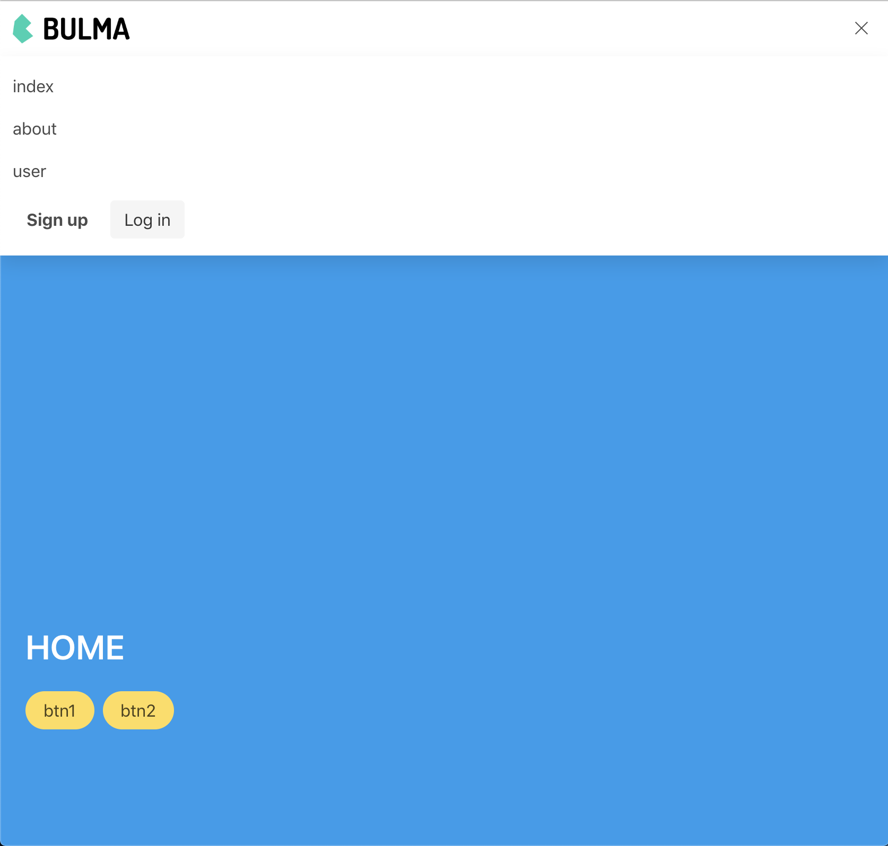
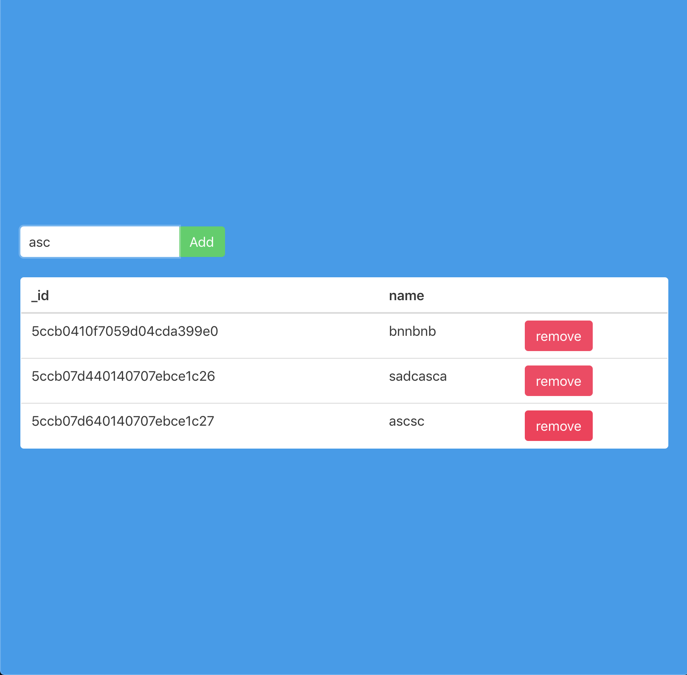

# nuxt-template

My lovely Nuxt.js project starter pack for full stack frontend and backend

## include

- [nuxt](https://nuxtjs.org/)
- [tsc](https://nuxtjs.org/guide/typescript)
- [scss](https://nuxtjs.org/faq/pre-processors/)
- [koa](https://koajs.com)
- [buefy](https://buefy.github.io)

## screenshot

_setup database via [dotenv-extends](https://www.npmjs.com/package/dotenv-extended)_
