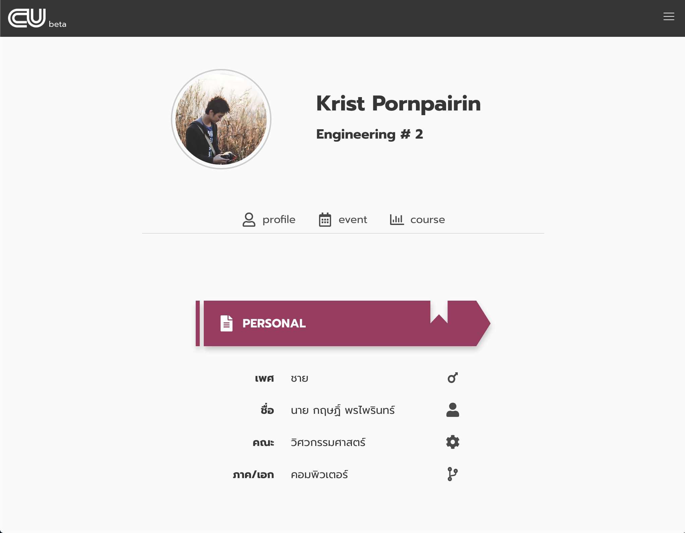
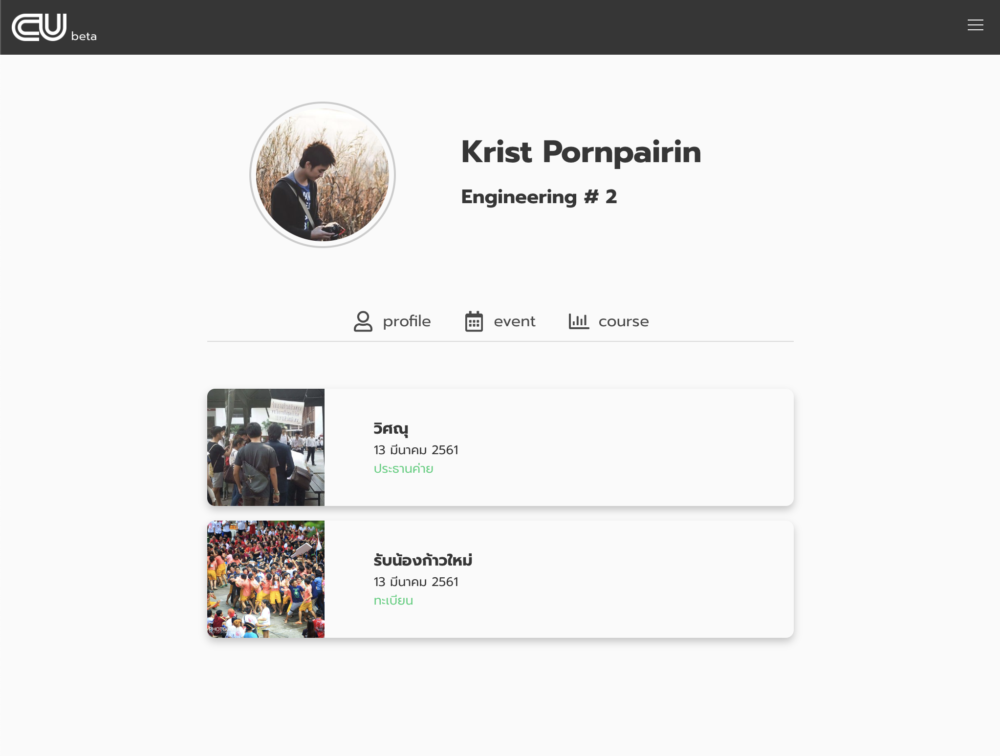

# REG.CHULA

This is my dump full-stack web site for improving [reg.chula.ac.th](https://reg.chula.ac.th). hope you like this

try

```
yarn install
yarn dev
```

and go to [http://0.0.0.0:3000](http://0.0.0.0:3000) for website

## include

- [nuxt](https://nuxtjs.org/)
- [tsc](https://nuxtjs.org/guide/typescript)
- [scss](https://nuxtjs.org/faq/pre-processors/)
- [koa](https://koajs.com)
- [buefy](https://buefy.github.io)

## screenshot






# About

feel free to contact us
090-020-6430
